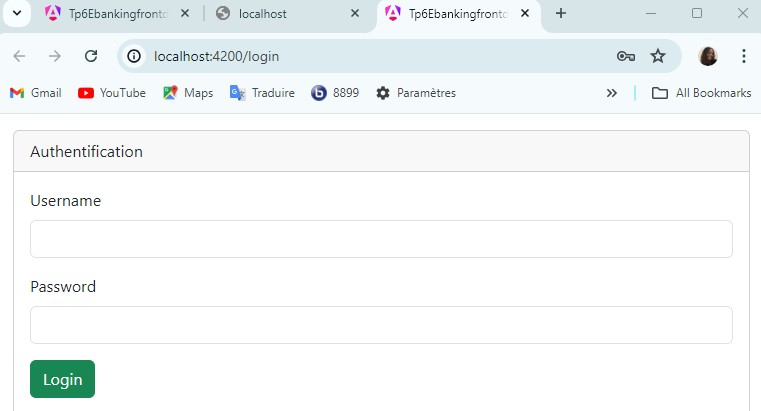
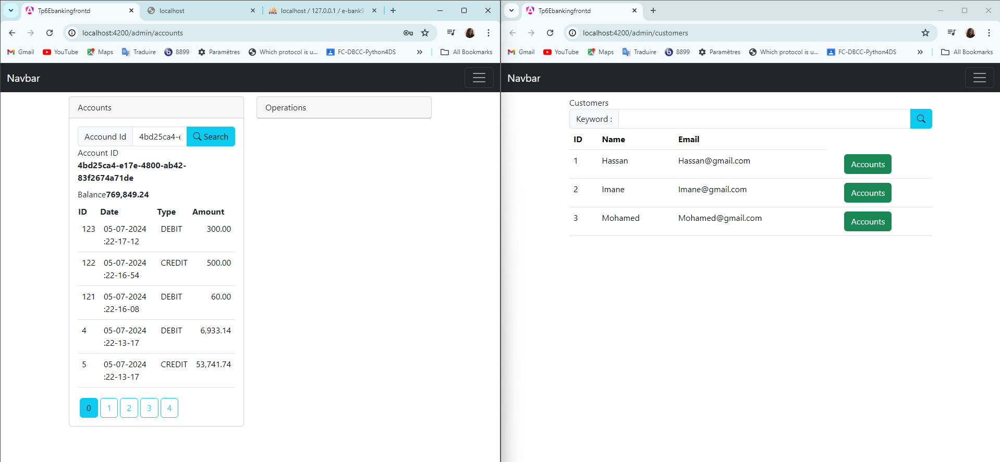
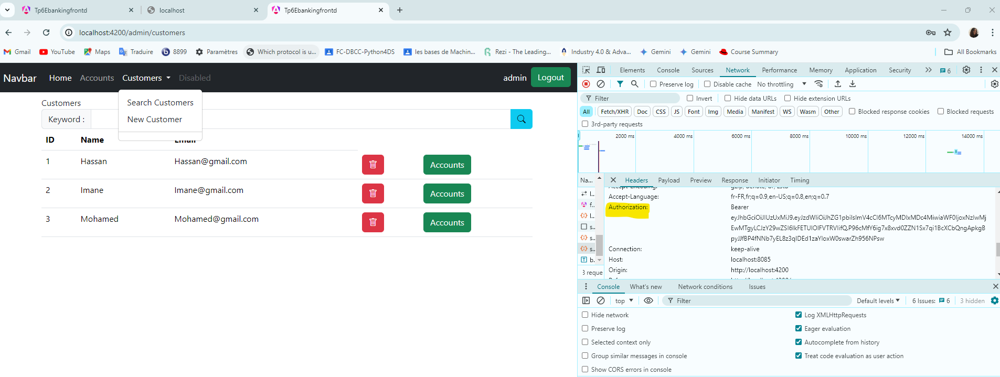
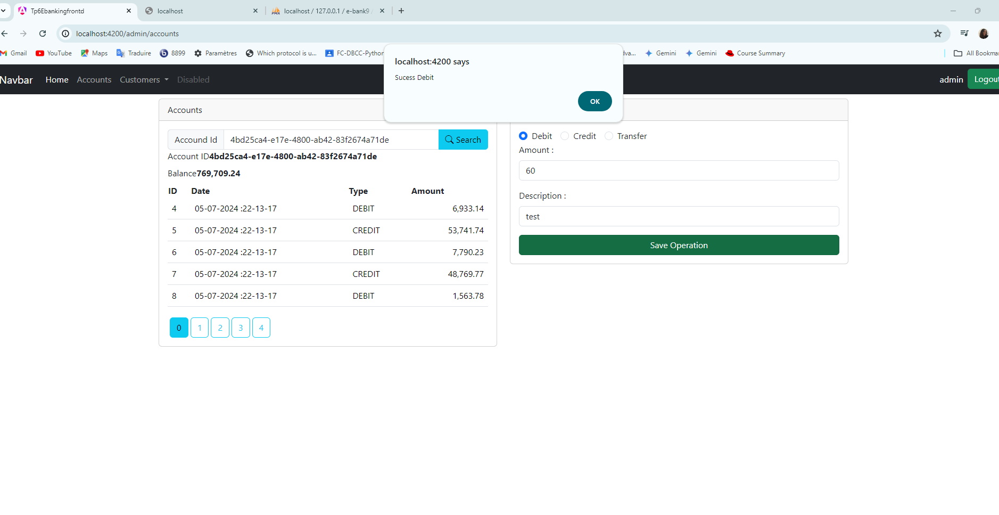

<h2>Application Digital Banking Angular</h2>

Creating an application for digital banking. Each account belongs to a customer and can undergo debit, credit, or transfer operations. There are two types of accounts: current accounts and savings accounts.
To create this application, we will:
Create a Spring Boot project.
Define JPA entities (Customer, BankAccount, SavingAccount, CurrentAccount, AccountOperation).
Create JPA Repository interfaces based on Spring Data.
Test the DAO layer.
Create the service layer and DTOs.
Set up the RestController.
Test the Restful web services.
Document the application with Swagger and Spring Boot 3.
Secure the application with an authentication system based on Spring Security and JSON Web Token.

<h4>Login</h4>

<h4>User Interface</h4>

<h4>Admin Interface</h4>
<h5>Search Customers</h5>

<h5>Create New Operations</h5>

